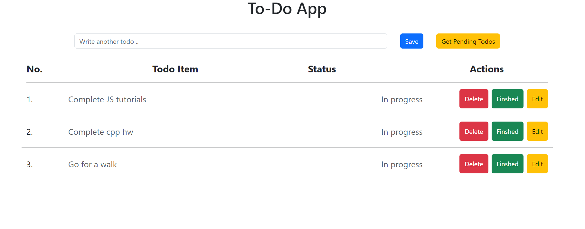

Basic JavaScript ToDo App
======
Vanilla (**JavaScript**)-only

#### Screenshot



## Synopsis

Just a basic todo app that I wrote using vanilla **JavaScript** so there's not much to it.

## Code Example

```
function removeTodo(event) {
    let deleteButtonPressed = event.target;   // get the delete button
    //get the index of the todo item in the array using get-attribute property
    let indexTobeRemoved = Number(deleteButtonPressed.getAttribute("todo-idx")); 
    todos.splice(indexTobeRemoved, 1); // array function to remove todo-item from array
    reRenderTodos(); // Re-rendering the todos array
}
```

## Motivation

Learning and enforcing good structural and practical **strategies** for JavaScript development.

### Directory Layout

```
.
├── /css/                # CSS folder
│   └── /style.css       # Basic CSS stylesheet
├── /js/                 # JavaScript folder
│   └── /app.js          # Main app source
├── .gitignore           # Version control omission file
│── index.html           # Main entry point
└── README.md            # This file
```

## Installation

Checkout this repo and open index.html:

```
	> https://github.com/abhishek-bisht-21/Todo-VanilaJS.git
	> cd todo-js-basic
	> open index.html
```

## Usage

Use to add/edit/delete tasks without persistence (no backend).

## Contributing

1. Fork it!
2. Create your feature branch: `git checkout -b my-new-feature`
3. Commit your changes: `git commit -am 'Add some feature'`
4. Push to the branch: `git push origin my-new-feature`
5. Submit a pull request :D


